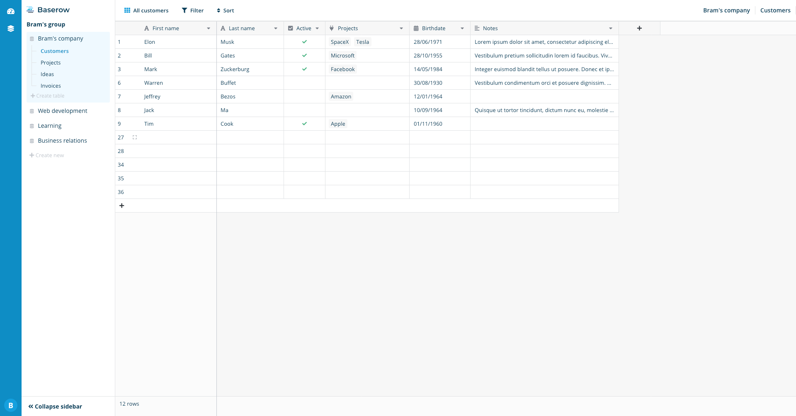

# Baserow

Open source no-code database tool and Airtable alternative. Join our community on 
Gitter https://gitter.im/bramw-baserow/community.

> Warning: From version 0.8.0 to 1.4.1 of Baserow the docker-compose.yml included in 
> the root of this repository has exposed an unsecured redis instance by default on the 
> ip:port 0.0.0.0:6379.
> If you have been running a server which is accessible via the internet using this 
> `docker-compose.yml` then it is possible this redis server has been exposed to the 
> internet depending on your operating system, networking setup and firewall settings.
> Please update to the latest version of Baserow, 1.4.2 which no longer exposes the 
> redis, db and mjml containers. Additionally, 1.4.2 only exposes the backend, 
> web-frontend and media containers on localhost and not on 0.0.0.0. If you were 
> previously relying on `docker-compose.yml` publicly exposing Baserow then please 
> follow the [Make Baserow publicly accessible](./docs/guides/baserow-docker-how-to.md)
> section in the docker how to guide.

[](https://heroku.com/deploy?template=https://github.com/bram2w/baserow/tree/master)
*Beta*

**We're hiring** remote developers! More information at 
https://baserow.io/jobs/experienced-full-stack-developer.



## Introduction

Create own database without technical experience. Our user friendly no-code tool gives
you the powers of a developer without leaving your browser.

* Uses popular frameworks like [Django](https://www.djangoproject.com/) and
  [Nuxt.js](https://nuxtjs.org/).
* Uses [PostgreSQL](https://www.postgresql.org/).
* Open source.
* MIT license.
* Self hosted.
* Headless and API first.
* Modular architecture.
* Supports plugins.
* Includes a plugin boilerplate.
* Unlimited rows.
* Runs in your browser.
* Alternative to Airtable.

## Self host

* [**Heroku**: Easily install and scale up on Heroku by using the template.](./docs/guides/installation/install-on-heroku.md)
* [**Cloudron**: Install and update Baserow on your own Cloudron server.](./docs/guides/installation/install-on-cloudron.md)
* [**Ubuntu**: Manually install Baserow step by step on a clean Ubuntu server. **not recommended**](./docs/guides/installation/install-on-ubuntu.md)

## Try out Baserow on your machine 

If you just want to try out Baserow, you can create an account on the SaaS version at
https://baserow.io. Just click on the create account or register button at the 
homepage.

If you want to try out Baserow on your own computer, you can easily start a local 
environment via `docker-compose`. Just clone the repository, run the following commands
and visit http://localhost:3000 in your browser.

```
$ git clone --branch master https://gitlab.com/bramw/baserow.git
$ cd baserow
$ docker-compose up 
```

More detailed instructions and more information about running baserow locally check 
[here](docs/guides/running-baserow-locally.md) or at 
https://baserow.io/docs/guides/running-baserow-locally.

## Development environment

If you want to contribute to Baserow you need to setup the development environment. 
Execute the following commands to start a development version of the baserow environment
which has debug and hot re-loading features enabled.

```
$ git clone --branch master https://gitlab.com/bramw/baserow.git
$ cd baserow
$ docker-compose -f docker-compose.yml -f docker-compose.dev.yml up
$ # OR use our ./dev.sh script which also ensures your dev containers run as your user
$ ./dev.sh --build
```

The Baserow development environment is now running. Visit http://localhost:3000 in your
browser and you should see a working version in development mode.

More detailed instructions and more information about the development environment can 
be found [here](./docs/development/development-environment.md) or at 
https://baserow.io/docs/development/development-environment.

## Plugin development

Because of the modular architecture of Baserow it is possible to create plugins. Make 
your own fields, views, applications, pages or endpoints. We also have a plugin 
boilerplate to get you started right away. More information can be found in the 
[plugin introduction](./docs/plugins/introduction.md) and in the 
[plugin boilerplate docs](./docs/plugins/boilerplate.md).

## Official documentation

The official documentation can be found on the website at https://baserow.io/docs/index
or [here](./docs/index.md) inside the repository. The API docs can be found here at 
https://api.baserow.io/api/redoc/ or if you are looking for the OpenAPI schema here
https://api.baserow.io/api/schema.json.

## Become a sponsor

If you would like to get new features faster, then you might want to consider becoming
a sponsor. By becoming a sponsor we can spend more time on Baserow which means faster
development.

[Become a GitHub Sponsor](https://github.com/sponsors/bram2w)

## Meta

Created by Baserow B.V. - bram@baserow.io.

Distributes under the MIT license. See `LICENSE` for more information.

Version: 1.4.3

The official repository can be found at https://gitlab.com/bramw/baserow.

The changelog can be found [here](./changelog.md).

Become a GitHub Sponsor [here](https://github.com/sponsors/bram2w).

Community chat via https://gitter.im/bramw-baserow/community.
