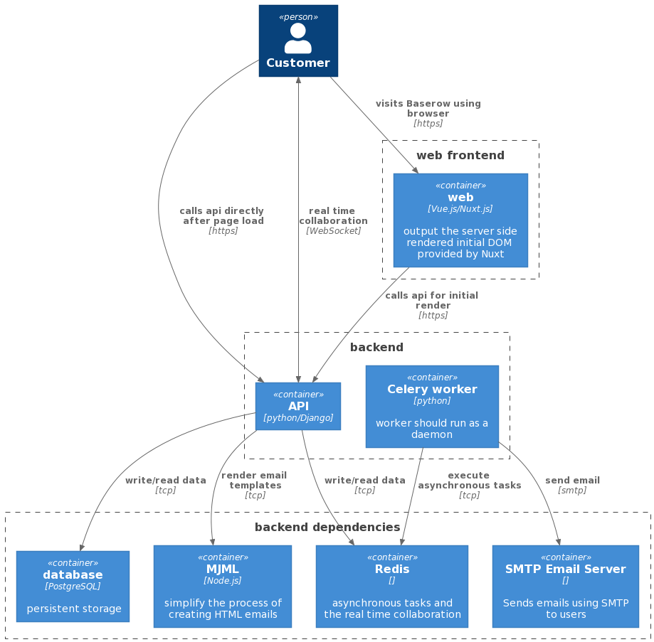

# Baserow introduction

## Architecture

Baserow consists of two main components:

1. The **backend** is a Python Django application that exposes a REST API. This is the
   core of Baserow and it does not have a user interface. The [API spec](./api.md) can
   be found here. The persistent state is stored by default in a PostgreSQL database.
   MySQL and SQLite are not supported at the moment, but probably will be in the future.
1. The **web frontend** is an application that serves as a user interface for the
   backend and is made in [NuxtJS](https://nuxtjs.org/) and
   [Vue.js](https://vuejs.org/). It communicates to the backend via the REST API.
   


## Backend

The backend consists of the **core**, **api** and **database** apps. The package also
contains base settings that can be extended. The REST API is written as a decoupled
component which is not required to run Baserow. It is highly recommended though. The
same goes for the database app, which is written as a plugin for Baserow. Without it you
would only have the core which has functionality like authentication, groups and the
application abstraction.

### Handlers

If you look at the code of the API views you will notice that they use classes like
CoreHandler, TableHandler, FieldHandler etc. The API views are actually a REST API shell
around these handlers which are doing the actual job. The reason why we choose to do it
this way is that if we ever want to implement a Web Socket API, SOAP API or any other
API we can also build that around the same handler. That way we never have to write code
twice. It is also useful for when you want to do something via the command line. If you
for example want to create a new group you can do the following.

```python
from django.contrib.auth import get_user_model
from baserow.core.handler import CoreHandler

User = get_user_model()
user = User.objects.get(pk=1)
group = CoreHandler().create_group(user, name='Example group')
```

## Web frontend

The web-frontend consists of the **core** and **database** modules. The package also
contains some base config that can be extended. It is basically a user-friendly shell
around the backend that can run in your browser. It is made using
[NuxtJS](https://nuxtjs.org/).

### Style guide

There is a style guide containing examples of all components on
https://baserow.io/style-guide. Or if you want to see it on your local environment
http://localhost:8000/style-guide.

## Concepts

### Groups

A group can contain multiple applications. It can be used to define a company, and it is
possible to invite additional users to a group. Every user in the group has access to
all the applications within that group. Live collaboration allows users to immediately
see changes made by others without having to refresh the page. Groups can easily be
created, edited and deleted via the `baserow.core.handler.CoreHandler`
and via the REST API.

### Applications

An application is more of an abstraction that can be added to a group. By default the
database plugin is included which contains the database application. Via the
"create new" button in the sidebar a new application instance can be created for the
selected group. When clicked you will see a context menu with all the application types.
Plugins can introduce new application types. Applications can easily be created, edited
and deleted via the `baserow.core.handler.CoreHandler` and via the REST API.

### Database plugin

More information about the concepts of the database application can be found on the
[database plugin introduction page](./database-plugin.md).

## Environment variables

In combination with the default settings and config the following environment variables
are accepted.

* `DATABASE_NAME` (default `baserow`): The name of the PostgreSQL database.
* `DATABASE_USER` (default `baserow`): The username for the PostgreSQL database.
* `DATABASE_PASSWORD` (default `baserow`): The password for the PostgreSQL database.
* `DATABASE_HOST` (default `db`): The hostname of the PostgreSQL server.
* `DATABASE_PORT` (default `5432`): The port of the PostgreSQL server.
* `MJML_SERVER_HOST` (default `mjml`): The hostname of the MJML TCP server. In the
  development environment we use the `liminspace/mjml-tcpserver:0.10` image.
* `MJML_SERVER_PORT` (default `28101`): The port of the MJML TCP server.
* `PUBLIC_BACKEND_URL` (default `http://localhost:8000`): The publicly accessible URL of
  the backend. For the development environment this is `http://localhost:8000`, but if
  you change the port to 9000 it will be `http://localhost:9000`. You should be able to
  lookup this url with your browser.
* `PRIVATE_BACKEND_URL` (default `http://backend:8000`): Not only the browser, but also
  the web-frontend server should be able to make HTTP requests to the backend. It might
  not have access to the `PUBLIC_BACKEND_URL` or there could be a more direct route,
  (e.g. from container to container instead of via the internet). In case of the
  development environment the backend container be accessed via the `backend` hostname
  and because the server is also running on port 8000 inside the container, the private
  backend URL should be `http://backend:8000`.
* `PUBLIC_WEB_FRONTEND_URL` (default `http://localhost:3000`): The publicly accessible
  URL of the web-frontend. For the development environment this is
  `http://localhost:3000`, but again you can change the port to whatever you wish. This
  url is reachable with your browser.
* `FROM_EMAIL` (default `no-reply@localhost`): The 'from' email address of the emails
  that the platform sends. Like when a user requests a password recovery.
* `INITIAL_TABLE_DATA_LIMIT` (default `null`): Indicates the initial table data limit.
  If for example 100 is provided then it will not be possible to import a CSV file with
  more than 100 rows.
* `REDIS_HOST` (default `redis`): The hostname of the Redis server.
* `REDIS_PORT` (default `6379`): The port of the Redis server.
* `REDIS_USER` (default ``): The username of the Redis server.
* `REDIS_PASSWORD` (default ``):  The password of the Redis server.
* `REDIS_PROTOCOL` (default `redis`): The redis protocol. Can either be `redis` or
  `rediss`.
* `EMAIL_SMTP` (default ``): Providing anything other than an empty string will enable
  SMTP email.
* `EMAIL_SMTP_HOST` (default `localhost`): The hostname of the SMTP server.
* `EMAIL_SMPT_USE_TLS` (default ``): Providing anything other than an empty string will
  enable connecting to the SMTP server via TLS.
* `EMAIL_SMTP_PORT` (default `25`): The port of the SMTP server.
* `EMAIL_SMTP_USER` (default ``): The username for the SMTP server.
* `EMAIL_SMTP_PASSWORD` (default ``): The password of the SMTP server.
