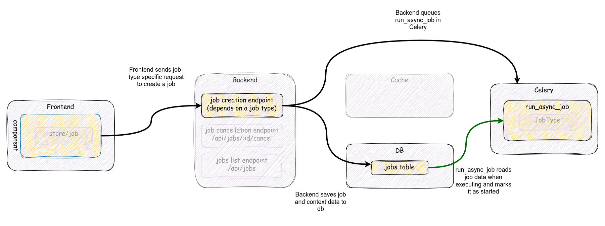
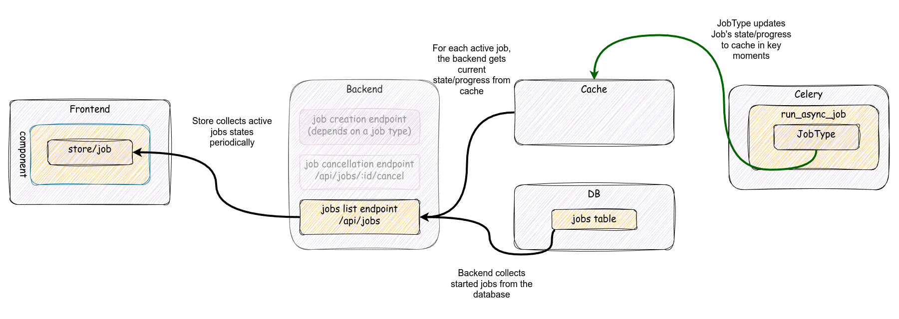
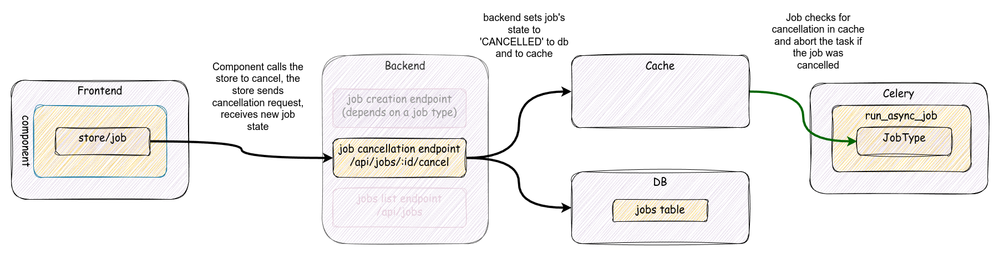

# Jobs

<!-- TOC -->

* [Jobs](#jobs)
    * [Job workflows](#job-workflows)
        * [Job creation and execution](#job-creation-and-execution)
        * [Job state update](#job-state-update)
            * [Job's state propagation](#jobs-state-propagation)
            * [Job's state query](#jobs-state-query)
        * [Job cancellation](#job-cancellation)
        * [Job cleanup](#job-cleanup)
    * [Backend](#backend)
        * [`JobHandler`](#jobhandler)
        * [`JobType` subclass](#jobtype-subclass)
        * [`Job` submodel](#job-submodel)
            * [`Job.state`](#jobstate)
        * [Progress tracking](#progress-tracking)
    * [Cache layer](#cache-layer)
    * [Frontend](#frontend)
        * [Job store](#job-store)
        * [Job mixin](#job-mixin)
        * [Usage in components](#usage-in-components)

<!-- TOC -->

This document is a technical overview documentation to describe main concepts,
components and workflows behind job subsystem in Baserow, and shows possible extension
points. It's intended for developers who want to work with jobs and need to comprehend
the main concepts and how they interact in Baserow.

Job subsystem allows to move costly user-triggered operations, like duplicating
objects or exporting data, to an outside backend process. When a user requests such
operation, a job is created in the backend and is scheduled on a task queue, eventually
is executed in a Celery worker. UI can show job's progress and, in some cases, allows to
cancel a specific job.

The job subsystem is an internal framework in Baserow that defines specific job types
and orchestrates the execution. It follows several common patterns used in the backend.
See [backend notes](#backend) for details.

## Job workflows

Job subsystem contains three main workflows:

* Job creation and execution
* Job status update
* Job cancellation

Additionally, there's an independent job cleanup task, which should be considered as
supplementary to the job system. See [job cleanup](#job-cleanup) for details.

Note that Baserow deployment contains several different components (backend, frontend,
celery workers) that communicate internally. They use different communication
channels and styles to pass messages/data. While specific paths of communication can be
synchronous, overall process is asynchronous in the context of the whole system.

### Job creation and execution

Job creation depends on a job type. There's no generic endpoint to create a job.
Usually a job of a specific type is created with a dedicated endpoint. However, each
endpoint that is responsible for job creation should return a job structure enriched
with job-specific properties.

Job creation and execution workflow is shown on the graph below:



The workflow consists of the following steps:

* The frontend component calls a job-type specific endpoint on the backend to create a
  job (usually by using a relevant Service class).
* The endpoint prepares all required inputs and internally calls
  `baserow.core.jobs.handlers:JobHandler.create_and_start_job()` method to create a job
  instance and schedules its execution in the task queue (Celery). Backend should
  return job structure immediately after that. The rest of the flow happens in Celery
  independently and asynchronously from the frontend/backend path.
* Celery worker picks up `baserow.core.jobs.tasks:run_async_job` task, gets the job's
  details from the database, sets the job's state to `started` and calls
  `JobHandler.run()`
  usually in a transaction. See below for details on transaction handling.
* `JobHandler.run()` method executes the job by calling appropriate `JobType.run()`
  which is
  actual job's implementation. A job is usually a step-by-step procedure, but the job
  implementation should
  also [update it's state and progress](#job-state-update) during execution. While the
  state is being updated, a [job cancellation](#job-cancellation) check is performed.
* If a job has been completed, it will be marked as `finished`. In case of an error, the
  job will be marked as `failed` or `cancelled` if it was requested to cancel.

Celery task queue receives a task to execute a specific job (`run_async_task` with job
id). Job tasks are scheduled for `export` workers. A worker will attempt to execute the
task, however:

* There is no guarantee that a job will be picked and started in any specific time
  frame.
* There is no guarantee that a job will be executed correctly.
* If a job fails, it won't be resumed.
* If a job takes more than a `BASEROW_JOB_SOFT_TIME_LIMIT` limit, the worker will be
  terminated and marked as `failed`
* All jobs are cleaned (removed) from the database after a specific period.
  See [Job cleanup](#job-cleanup) for details
* A job can be cancelled by a user before or during its execution.

A job can be executed in a transaction, but it's not a strict rule and depends on a
specific job type.
`JobType.transaction_atomic_context` allows to set a specific transaction context.

If a job is executed in a transaction and the transaction has isolation level set to
repeatable reads, the purpose of it is to guarantee data snapshot consistency in the
database.
This is an important factor for tasks that operate on multiple tables, allowing to
preserve between-tables linkage consistency. Running a job in a transaction makes any
immediate change to the job table invisible to other processes, so we
use [cache](#cache-layer) to track a job's state updates both ways: propagating it from
a job and signaling important changes from the outside to a job.

If a job fails or is cancelled, it will raise an appropriate exception and any
established transaction will be aborted. This allows to clean up any database resources
created by a job automatically. Otherwise, it's up to `JobType` subclass to perform
proper cleanup.

### Job state update

A job status update is a workflow where a job propagates its current status. Job's
progress is usually monitored by the frontend component for the user. Because the task
can be executed in a transaction, other processes cannot see the current state from the
database, and we use [cache as a proxy for state values](#cache-layer).

When a job is being executed, it should update periodically ("in key moments") its
current [state](#job-state) and [progress value](#progress-tracking).

The workflow of updating a job's state is shown on the diagram below. It is actually
comprised of two separate workflows that are independent of each other:



#### Job's state propagation

This workflow propagates Job's state outside the Celery worker:

* `Job` instance receives `Progress` instance as a part of the `Job.run()` signature.
* The job updates the `Progress` instance in key moments of its processing.
* `Progress` instance executes a callback that will directly update `Job.state` and
  `Job.progress_percentage` values and update the job's cached state.

#### Job's state query

A separate workflow is used by the frontend to query for the current job's state and
progress:

* In the frontend, job store periodically queries the backend for a list of active
  jobs [(see Job store for details)](#job-store).
* The backend (after checking for permissions and applying internal filtering):
    * queries the database for specified jobs
    * when serializing the response, it gets `Job.state` and `Job.progress_percentage`
      values from the cache and then from the database if the cache doesn't provide any.

### Job cancellation

The job subsystem allows the cancellation of a job. The cancellation can only be
triggered by the owner of the job. A cancellation request means the user is not
interested in any continuation of the job's execution and any result or a product of
such execution should be discarded.

A job cancellation request can be issued at any moment. However, due to asynchronous
nature of communication, the request in the worker may be handled when the job's state
is different from the moment when the request was issued from the frontend. Not all
states are cancellable, and, if a state is not cancellable, it may raise an exception. A
table below presents which states are cancellable.

| Job state         | can be cancelled | exception           | notes                               |
|-------------------|------------------|---------------------|-------------------------------------|
| `pending`         | yes              |                     |
| `started`         | yes              |                     |
| any running state | yes              |                     |                                     |
| `failed`          | no               | `JobNotCancellable` |                                     |
| `cancelled`       | no               |                     | No error, as it's already cancelled |
| `finished`        | no               | `JobNotCancellable` |                                     | 

Because of that asynchronous nature, sending a cancellation request to a running job is
not straightforward. The job is executed synchronously in a Celery worker, thus the
cancellation requires a side channel to inject information from the outside into a job
that it has been cancelled. This is performed by checking [cache layer](#cache-layer) in
key moments of the job's processing:

* When a job updates its progress. See [Progress notes](#progress-tracking) for details.
* In `JobHandler.run()` when an actual job has been cancelled, but the execution control
  wasn't yet returned to the `run_async_job` task.

A cancelled job will raise a `JobCancelled` exception, which will effectively stop the
job and rollback any transaction, discarding any pending changes in the database.
Note that filesystem resources related to that job won't be cleaned in this workflow.

Appropriate `JobType.before_delete()` should be implemented to clean any outstanding
resources created by the job. This method will be executed during a
separate [cleanup job](#job-cleanup) that will remove stale/done jobs.

A job cannot be cancelled once it has been executed. If a job has been finished,
successfully or not, an attempt to cancel such a job will result in `JobNotCancellable`
error.

Job cancellation workflow is shown on the diagram below:



* The owner of the job triggers the cancellation via the UI where a component should
  dispatch `job/cancel` action, which will call `/api/job/$id/cancel/` endpoint in
  the backend.
* The backend calls `JobHandler.cancel_job()` which effectively sets `Job.state` to
  `cancelled` in the model and [in the cache](#cache-layer). This is the final step for
  the backend.
* If a job is picked by a Celery worker, sanity checks will be performed:
    * if a job has not been started yet but the job is not in `pending` state,
      `run_asyc_job` won't start this job.
    * If a job is running, it will check the state in the cache every time just before
      updating the progress percentage. If the job has been canceled, a `JobCancelled`
      exception is raised, stopping the job execution. If the canceled state is not set,
      the job will update the state in the cache so that the UI can properly monitor the
      progress.
    * Just before returning from `JobHandler.run` a final check for cancellation is
      performed.

### Job cleanup

Job cleanup is an independent task that is executed periodically in Celery. The primary
intention of this task is that:

* All jobs that have been created longer than `BASEROW_JOB_EXPIRATION_TIME_LIMIT` (by
  default: 30 days) and are finished, cancelled or failed should be removed permanently.
* All jobs that were created more than `BASEROW_JOB_SOFT_TIME_LIMIT` (30 minutes) ago
  should be marked as failed due to a timeout.

Note that when a job is being removed `JobType.before_delete()` hook will be called.
This is a hook that allows to do any job-type cleanup.

## Backend

Most of the functionality resides in the backend's code. The code follows common
patterns used in Baserow codebase.

### `JobHandler`

`baserow.core.jobs.handlers:JobHandler` is used to expose high-level interface to manage
jobs. It contains methods to create, query for, cancel, and remove jobs. It's used by
both, the web application and tasks in Celery.

### `JobType` subclass

A `baserow.core.jobs.registires:JobType` class is a base class for any specific job
type. Its main purpose is to provide a common interface to run specific job's actions.
When implementing a new job type only `JobType.run` method is required to be
implemented. However, a subclass can also:

* Hook into a job creation by preprocessing values provided by a user/postprocessing a
  created job.
* Hook into a job deletion process.
* Provide a job error handler.
* Provide custom job serializer fields or a custom serializer for a job model.
* Pap exceptions to specific HTTP response codes.
* Have [a model class](#job-sub-models).

`JobType` subclasses are registered and managed with a job type registry, so it should
be easy to add new job types without modifying existing code. Each job type should have
a distinctive name in the registry.

### `Job` submodel

`baserow.core.jobs.models:Job` base job model class. Usually each job type has defined
own `Job` submodel. A scheduled job may need to know an extra context to execute
properly. For example, a job that duplicates a table needs to know which table to
duplicate. `Job` subclass can store such information for the execution. Base `Job` model
stores basic job information: identification, ownership, and the current state.

#### `Job.state`

`Job.state` stores state's description. The `Job.state` value can be one of predefined
constant values for known states:

* `pending` - when a job is scheduled and waits to be picked up by a Celery worker
* `started` - when a job has been started
* `finished` - when a job has been executed successfully
* `cancelled` - when a job has been cancelled
* `failed` - when an error happened during the execution. Details of the error should be
  present in `error` and `human_readable_error` properties.

Note that other values can be present. A job can set the state to more descriptive
value.
An example is a snapshot creation job type that sets state to `import-table-$id` for
each table that is being created in a snapshot dataset.

Because of the variety of possible values, a job's state must be interpreted properly to
tell if a job is running or not. Such interpretation happens in the backend (
`Job.object` has dedicated methods to get pending/running/done queryset) and in the
frontend (`mixin/job` provides calculated properties for different states).

Note that job states `finished`, `failed` and `cancelled` are considered as final: they
should not be changed once set. A job that has such state won't be executed anymore,
even if it wasn't executed yet (a job can be cancelled before its execution).

A job can change its state in certain direction only. Eventually a job will be in one of
final states. A diagram below shows possible state changes:


### Progress tracking

`Job.progress_percentage` stores the current job progress value in percentage. This
value should be updated during the execution. However, a job may be actually a very
complex and layered set of tasks, where one task runs several smaller tasks in a
sequence. Those smaller tasks may be written with isolation in mind, so they may not
know anything about their caller. Upper layers may still want to know how much work was
performed and expose this information for others to consume. To establish a
communication channel to propagate progress updates from the inside of a job, a helper
`baserow.core.utils:Progress` class is used.

The `Progress` class provides an interface to set or increase progress. `Progress` class
can spawn child instances to track fragmentary progress of sub-tasks. If a job can have
sub-tasks, they can be tracked independently but within specific boundaries of the
parent's progress. For example, a job updates its `Progress` instance to 40% and then
runs a code that internally tracks its progress from 0% to 100%, but from the job's
perspective, it's an increase from 40% to 50%. A child progress will notify the parent
of its change, and the parent will recalculate its relative change.

The `Progress` class is fairly independent of the rest of the system, and doesn't know
anything about jobs or how it's used. To connect it with the context where it's used, it
can receive a callback function to be called when a progress value changes. A callback
can be created with a job's scope so it can have access to the job's variables.

When a `JobHandler.run` prepares a job to execute it, creates also such a callback. This
callback will:

* Receive the current job instance.
* Check the cache if the job has been cancelled and raise the `JobCancelled` exception.
* Update `Job.state` and `Job.progress_percentage` values locally and
  refresh [cached values](#cache-layer).

## Cache layer

During the job's execution, the cache layer is used to propagate the job's state between
the backend and the Celery worker. Because a job can be executed in a transaction, local
changes to the job will be invisible to other database sessions. The cache (Redis store)
is used as a proxy to current `Job.state` and `Job.progress_percentage` values in the
backend process. Also, this is a channel to propagate cancellation state back to the
worker.

Cache entry's key is constructed from `Job.id` value and contains serialized dictionary
with `state` and `progress_percentage` keys/values.

Once a job execution is completed, the cache entry for that job should be removed.

## Frontend

There's a set of patterns used in the frontend to effectively track and manage job's
state in a Vue component. Any component that creates or want to check job's execution
state should follow those patterns.

### Job store

Job store is used to manage the state of active jobs that were created by the current
user.
Usually a single user has no more than a few running jobs. Job store internally tracks
the state of those jobs by querying `/api/jobs/` endpoint with specific job identifiers.

Job store exposes `job/create` action, which adds a job structure to the store and
initializes an internal poller that performs periodic checks of the state of known
active jobs.

The poller will work until all jobs in store are not in final states (
finished/cancelled/failed). When a new job is added, the poller is reinitialized.

### Job mixin

The main connector between a component and the store is `mixin/job` mixin. This mixin
provides helpers to properly expose a job's state and act on the state's change. A
component can define callbacks to extend behavior on job state's change.

Each job type can have different initial parameters, and usually a job is initialized by
a different endpoint. This makes job creation a variable that should be provided by a
component.

### Usage in components

Vue component that wants to interact with a job of any type should use the provided
`mixin/job` mixin. As written above, this mixin provides a skeleton to handle job state
management in the component. The mixin allows to handle one job instance per component
and provides:

* properties:

+ `job` - the job object
+ `jobIsRunning` - job is not done yet, may be pending or running
+ `jobIsFinished` - job has finished successfully
+ `jobIsEnded` - job was finished or failed
+ `jobHasFailed` - job failed with an error or it has been cancelled

* methods:

+ `createAndMonitorJob(job)` - a method to add a `job` object to the store.
+ `cancelJob()` - a method to cancel a job. It expects `job` property to be set.

The mixin expects the component will provide callbacks on `job.state` changes:

* `onJobFinished()`
* `onJobFailed()`
* `onJobCancelled()`

Additionally, the component should provide a method to handle errors:

* `showError({error,message})`

The component should create a job on its own and call `createAndMonitorJob` with a `job`
instance.

The component should use the `ProgressBar` subcomponent to display the progress:

```vue

<ProgressBar
    :value="job.progress_percentage"
    :status="jobHumanReadableState"
/>
```

The buttons for the job creation/cancellation are up to the component. Their state can
utilize properties above to control visibility.

