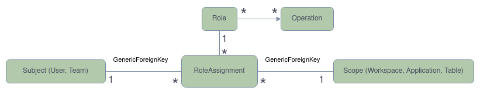

# 👩‍💻 RBAC guide

This documentation explain the general principles of the *Role based access
control* (RBAC) in Baserow. This is a technical documentation intended for
people who want to understand how RBAC works internally.

First you need to read the general `/docs/permissions-guide.md` file before
checking this one to understand the basic principles of the permission system.

## 📖 Glossary

This glossary extends the Permissions system related glossary.

**Role**: a *Role* is a set of *Operation* that can be assigned to a *Subject*.
When a *Role* is assigned to a *Subject*, this subject is granted the
*Permissions* for all *Operations* of this *Role*.

**Custom Role**: this term represents a *Role* that a *Actor* (likely admin) has
created, versus a *Role* that Baserow has created in its default set.

**Team**: a collection of *Subject* records, so that they can be managed in one
go. This would enable those with high *Role* to manage *Subjects* in bulk,
without having to assign *Role* individually to each *Subject*. A *Team* is
linked to only one *Workspace*.

**Role assignment**: an triplet that represents the assignation of a *Role* on a
*Subject* over a particular *Scope*.

**Scope**: by default, a *Role assignment* apply to all *Objects* of the
*Workspace*, but a *Role* application area can be limited to a specific *Object*
instance, the *Scope* of the *Role*. In this case, the *Permissions* granted by
the *Role* only apply to this *Object* and all its children *Objects*. The
default *Scope* for a *Role assignment* is the *Workspace*. For the `Database`
application the extra allowed *Scopes* are `Database` and `Table`.

## 📃 Main principles

These are some fondations on which the RBAC is based:

- The following structural roles exist:
  - **NO_ROLE**: to remove all permissions on the given *Scope* (and all its
    children by inheritance, see below).
  - **NO_ROLE_LOW_PRIORITY**: same as previous but if a *Team* has a *Role* at
    the same scope, the *Team* role is considered. It's necessary mostly because
    we can't remove the role at the group level for a `User`.
  - **VIEWER**: the set of read only operations. An operation is read only if it
    doesn't modify any data in the database.
- In addition to the structural roles, a few Roles exists by default. Here's a
  quick overview of their purpose:
  - **ADMIN**: can do anything on the *Workspace*.
  - **BUILDER**: can do anything but the permission management.
  - **EDITOR**: can create/update/delete rows in Tables.
  - **COMMENTER**: can only comment rows.
- An *Actor* can have different *Role assignments* at different *Scopes*
  including `Workspace`, `Application` and `Table`.
- A *Team* can have different *Roles assignments* at different *Scopes*
  including `Workspace`, `Application` and `Table`.
- an *Actor* can be in multiple *Teams*. These *Teams* have an influence on the
  way *Roles* are determined for this *Actor*. See below for more information.

To compute the *Role* to use when deciding to allow or not a *Permission
request* the following rules are applied:

- **Rule of closest ancestor *Role***: for an operation done on a given
  *Context*, the *Role assignment* on the closest ancestor of this *Context*
  (including itself) is considered regardless if it's a *Team* or an *Actor*
  *Role*.
- **Rule of Actor *Role* precedence**: on a given *Scope*, if there are at the
  same time some *Role assignments* for the *Actor* itself and for at least one
  of the *Teams* they belongs to, the *Actor* *Role* always takes precedence over
  the Team *Roles* unless it's the `NO_ROLE_LOW_PRIORITY` *Role*.
- **Rule of *Team* *Roles* inheritance**: if there is no *Actor* role on a given
  *Scope* or if it is `NO_ROLE_LOW_PRIORITY` then the *Operation sets* of the
  *Roles* of all *Teams* are "unioned". As the result, the most permissive
  *Team* *Role* wins.
- **Rule of reverse *Scope* inheritance**: when an *Actor* has a *Role
  assignment* with at least one of the `VIEWER` *Operations* on a given *Scope*,
  all ancestors of this *Scope* *Object* automatically gain the `VIEWER` *Role*
  even if they have `NO_ROLE` assigned according to the previous rules. This
  allow the *Actor* to being able to see all intermediate *Objects* and access
  the child *Object*. This automatic *Role* is ignored when applying the *Rule
  of closest ancestor*.

To summarize:

- Tables roles > Database roles > Workspace roles
- Actor roles > Team roles
- `NO_ROLE_LOW_PRIORITY` => use Team A roles + Team B roles + ...
- Any Role at level n -> Viewer role at level n-1

## 🎮 Examples

Given the previous rules a few examples to illustrate them:

---

**The Actor A has the following assignments**:

- BUILDER on Workspace 1
- VIEWER on Table 10 (child of Database 5)

**Result**:

- This Actor is BUILDER everywhere but VIEWER for the Table 10 and all children
  of the Table 10. (Rule of closest ancestor Role)

---

**The Actor A has the following assignments**:

- BUILDER on Workspace 1
- VIEWER on Table 10 (child of Database 5)

They are in the Team T with the following assignments:

- COMMENTER on Table 10
- NO_ROLE on Table 20 (also child of Database 5)

**Result**:

- The actor is VIEWER for the Table 10 and all children of the Table 10. (Rule
  of Actor Role precedence)
- The actor is NO_ROLE for the Table 20 and all children of the Table 20. (Rule
  of closest ancestor Role)
- This Actor is BUILDER everywhere else. (Rule of closest ancestor Role)

---

**The Actor A has the following assignments**:

- VIEWER on Workspace 1

They are in the Team T1 with the following assignments:

- COMMENTER on Table 10

They also are in the Team T2 with the following assignments:

- BUILDER on Table 10

**Result**:

The actor is BUILDER for the Table 10 and all children of the Table 10. (Rule of
Team Roles inheritance) This Actor is VIEWER everywhere else. (Rule of most
precise role)

---

**The Actor A has the following assignments**:

- NO_ROLE on Workspace 1

They are in the Team T1 with the following assignments:

- COMMENTER on Workspace 1

They also are in the Team T2 with the following assignments:

- BUILDER on Workspace 1

**Result**:

This Actor is NO_ROLE everywhere. (Rule of Actor Role precedence)

---

**The Actor A has the following assignments**:

- NO_ROLE_LOW_PERMISSION on Workspace 1

They are in the Team T1 with the following assignments:

- COMMENTER on Workspace 1

They also are in the Team T2 with the following assignments:

- BUILDER on Workspace 1

**Result**:

This Actor is COMMENTER and BUILDER everywhere (so BUILDER as it is the most
permissive). (Rule of Team Roles inheritance)

---

**The Actor A has the following assignments**:

- NO_ROLE on Workspace 1
- EDITOR on Table 10 (child of Database 5)

**Result**:

- The actor is EDITOR for the Table 10 and all children of the Table 10. (Rule
  of closest ancestor Role)
- The Actor is VIEWER for the Database 5, the Application 5 and the Workspace 1.
  (Rule of reverse Scope inheritance)
- This Actor is NO_ROLE everywhere else. (Rule of closest ancestor Role)

## ⚙️ Technical details

If you want to give a particular *Actor* a *Role* on a given *Scope* you have to
create a `RoleAssignment`. This is the central object of the RBAC system. The
whole information necessary to check a Permission request is stored in this
object. Here's the data model:

[source](https://viewer.diagrams.net/?tags=%7B%7D&highlight=0000ff&edit=_blank&layers=1&nav=1&title=Diagramme%20sans%20nom.drawio#R7Zpbj5s4GIZ%2FTaRupVZgQxIuk8wkXW13t2patdOblQe%2BAB2DkXFO%2FfU1YALE5FBtJpnp5CbCr83Jz%2Fu9spN08ChaTThJgr%2BZB7SDDG%2FVwTcdhBzbkp%2BZsC6ErokLweehV0hmJUzDH6BEQ6nz0IO0MVAwRkWYNEWXxTG4oqERztmyOWzGaPOuCfFBE6Yuobr6JfREUKh91Kv0dxD6QXlns%2BsUPREpB6s3SQPisWVNwrcdPOKMieIoWo2AZnNXzktx3nhH7%2BbBOMTimBM%2BL3FkTpbf6Oi9CCDwPiw%2BfnujXmNB6Fy98ARi4KE7Zly%2BVvwXrNXTi3U5JeDJGVJNxkXAfBYTelupQ87msQfZfQ3Zqsa8ZyyRoinF7yDEWuEmc8GkFIiIql5YheJr7fguu9RbW7VuVurKeWNdNmLB11%2FrjdpZWbM6LW9V53mDzCiyGbMYCmUcUqr6KbkHOiTug5%2B%2F1ohRxquxqeDsAUqxg3Cv3x8MsOyZsViUugczMqcS01CnpkCmbM5d2IOqdD%2FhPog941R9ZZRqN1CemACLQL69HKAq9I3x1uiVplVFWlqWAyUiXDRLgaiK8jeX2lz9AwvlW1VD2GyWymetuVIe1B6iknKv%2FoJvTc23HxmFQZpKz0bZ1G6btrJk5qllEAqYJiSf8KUMrqb99iOfSW%2FUgA%2FRyBkMj7aC1K2u5dg3%2B8ywAC5gdQw%2BXAalQmf2kHR8riyrvDKxGhXUssq2dwNt8PpVOF0NTgd1c%2Fd74UIe%2BtlhS850VYWMa8Ou6fM00gcdmT7mS0gfpBl8Or%2F%2Fni0%2FkPHqcwq8g%2BSFjU9Aoj9eTBJtB1Hf0GOo1xJDlvFIMYR1Si5LIGP0hfGHNJ%2F0HNQgSWjoSrOxWJEj9xReDjq7d5jdhtNZ2PUvmftV1t%2FVeg7lfhX1d42kf965b504948O9WPtE4wm%2Fp3z7p%2FR8NN%2Ff%2BLpcjVej8uAfvrLhv0g1a3M3p7y3xUkrTxO5oHWWT8X8n0PubUjeDERji27EeGOnuDdcwa4%2FVwC%2FKkE7bHb%2B4sFbevTOFrVvdbASweLJqfmrLaUk5IIlVtD2XTlbMpFNR5m9SAXanSgOqLQ83LrtBVy004787PKWeScphbR1nJqszQ%2BUIz4sYrR1L8uuWJCFnpqmPR95RUTwuVPCOXmpHtpTPrG0ny%2BmPLF5QkwbbBsvsW5NCZ9RXjFhOzt0Ls4JvuK6YjQw%2BfDtHtv16D0bwJcfWX2fPZYGoEWTrsXDP1m7bTssZxH2mO1MtED7vdYLvwvSLjfOwTprIWj%2F8J%2BhYQs62AlnQiSbFZ%2FsSh%2B%2F6n%2Bp4JvfwI%3D)

We can see that the Subject and Scope are two Django GenericForeign keys as they
can be different kind of objects.

When we want to assign a Role, we have to:

- set the `GroupUser.permissions` property to the Role UID, if the Actor is a
  `User` and the Scope of the Role assignment is the Workspace. This behavior
  helps to keep the compatibility between the `RolePermissionManagerType` and
  the `BasicPermissionManagerType`
- otherwise, create a new RoleAssignment object with the given data.

Then when we want to check a Permission request the `RolePermissionManagerType`
and the role `handler` are responsible to implement the rules listed in the Main
principle section.

## 🤔 A few considerations

- There are no automatic deletion cascades for the two GenericForeignKeys of a
`RoleAssignment`, so we have manually added the related model delete signals
handler to propagate a deletion when a *Subject* or a *Scope* linked to
`RoleAssignment` is deleted.

**TBD**:

- The roles endpoint is missing in the RBAC land.
- Some naming are bad and should be changed.
- Use the `HierarchicalMixin` instead of the `ObjectScopeType`.
- The system is almost ready to support Custom roles creation.
- We should add a page that shows for each object of a workspace, which role
  have the Actors to help users on debugging their role assignments.
- For now the real time update for permission is partially implemented. The user
  just has a message to tell them they have to refresh it's page to get the new
  permissions. It could be a bit more reactive without having the user to
  refresh the page.
